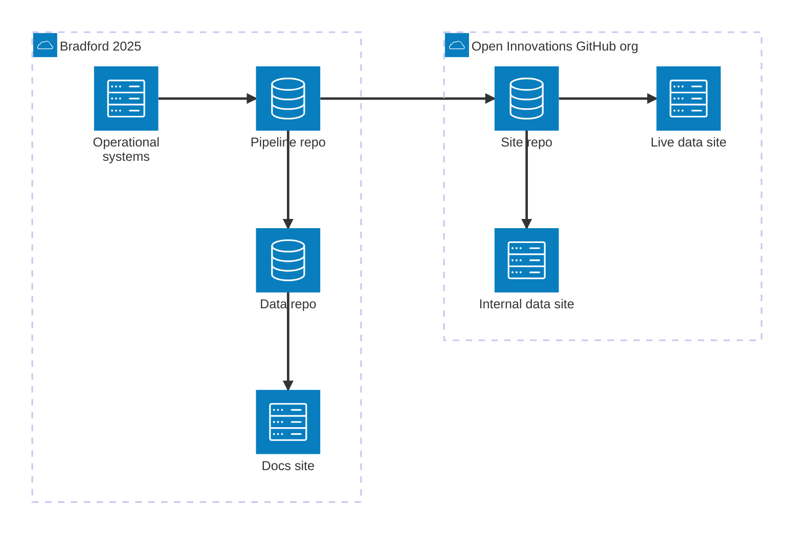

# Architecture overview

```mermaid
architecture-beta
    group b25(cloud)[Bradford 2025]

    service operationalsystems(server)[Operational systems] in b25

    service pipelinerepo(database)[Pipeline repo] in b25
    service datarepo(database)[Data repo] in b25
    service docssite(server)[Docs site] in b25

    operationalsystems:R --> L:pipelinerepo
    pipelinerepo:B --> T:datarepo
    datarepo:B --> T:docssite

    pipelinerepo:R --> L:siterepo

    group oi(cloud)[Open Innovations GitHub org]

    service siterepo(database)[Site repo] in oi

    service devsite(server)[Internal data site] in oi
    service livesite(server)[Live data site] in oi

    siterepo:R --> L:livesite
    siterepo:B --> T:devsite
```