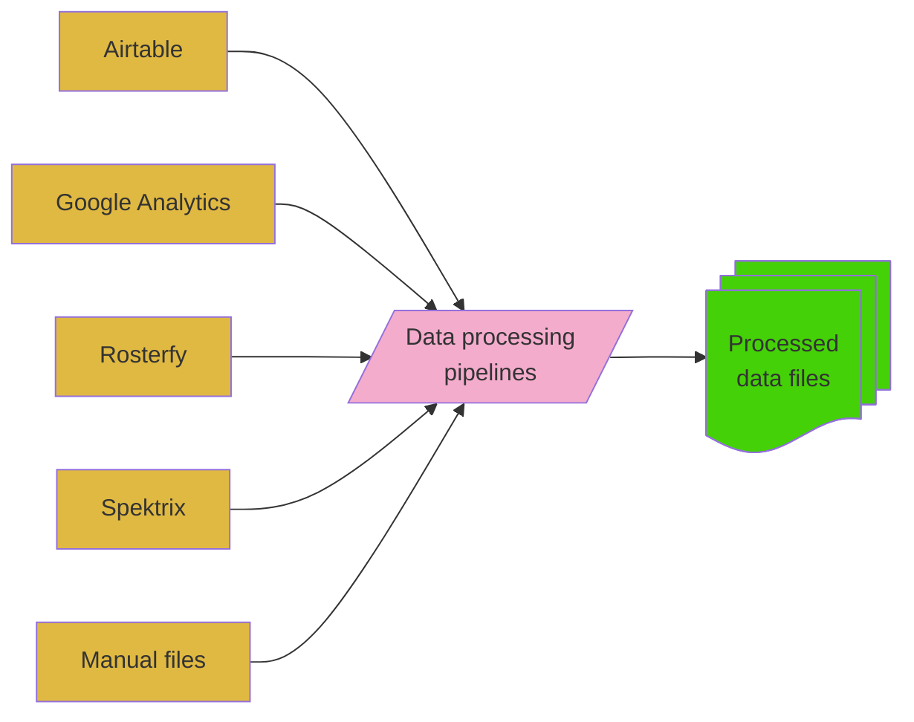

Data is extracted from _operational systems_ such as **Rosterfy**, **Airtable** and **Spektrix**.
The pipelines documented here are responsible for

* extracting the data from the source systems
* cleansing the data &mdash; filling in missing data and converting dates, etc
* summarising and anonymising to ensure no sensitive information (e.g. personal data) is made public
* combining multiple datasets into aggredate sets
* creating output files

This flow is shown schematically in the diagram below

The pipelines extract data from the following operational systems

* **Airtable**
    * Programme data (_projects_, _schedule_ and _venues_), covering **events**, **audience** and **participants**
    * Sustainability data (_carbon impact_ per project)
* **Google Analytics**
    * Digital events
    * Website traffic
* **Rosterfy**
    * Volunteers
    * Shifts
* **Spektrix**
    * Ticket sales
* **Manual files**
    * Events / schedule

There are also pipelines which

* combine event data from multiple systems,
* make publishable versions of the data,
* report on the data extracted from the operational systems.

The pipelines run each night at 03:25 UTC (3:25 AM GMT / 4:25 AM BST).

The [pipelines overview page](pipelines.md) provides more insight into how the pipelines work.